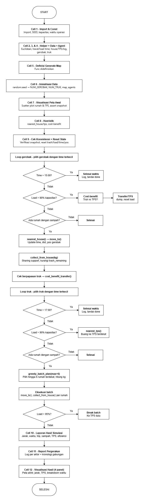

# Simulasi Pengangkutan Sampah
### Tugas Besar – Dasar Kecerdasan Artificial

---

## Daftar Isi

1. [Deskripsi Proyek](#1-deskripsi-proyek)
2. [Spesifikasi Sistem](#2-spesifikasi-sistem)
3. [Alur Program (Flow)](#3-alur-program-flow)
4. [Struktur Program & Penjelasan Cell](#4-struktur-program--penjelasan-cell)
5. [Algoritma Heuristik](#5-algoritma-heuristik)
6. [Rumus & Perhitungan](#6-rumus--perhitungan)
7. [Dokumentasi Visualisasi](#7-dokumentasi-visualisasi)
8. [Cara Menjalankan](#8-cara-menjalankan)
9. [Contoh Output](#9-contoh-output)
10. [Catatan Teknis & Desain Decision](#10-catatan-teknis--desain-decision)

---

## 1. Deskripsi Proyek

Program ini mensimulasikan sistem pengangkutan sampah di sebuah desa padat penduduk menggunakan **algoritma heuristik**. Simulasi melibatkan tiga jenis entitas utama, yaitu rumah penduduk, gerobak sampah, dan truk sampah yang berinteraksi secara real-time dalam satu peta acak berukuran 50×50 satuan jarak.

**Tujuan utama:**
- Menentukan rute terbaik bagi gerobak dan truk sampah dalam mengangkut sampah ke Tempat Pembuangan Sampah Akhir (TPS)
- Mengoptimalkan penggunaan waktu operasi yang terbatas
- Memberikan mekanisme *sharing* sampah antara agen

---

## 2. Spesifikasi Sistem

### Parameter Lingkungan

| Parameter | Nilai | Keterangan |
|---|---|---|
| Jumlah Rumah | 100 | Tetap |
| Ukuran Grid | 50 × 50 | Satuan jarak |
| Sampah per Rumah | 0 – 7 kg | Acak setiap sesi |
| Jumlah Gerobak | 5 – 7 | Acak saat inisialisasi |
| Jumlah Truk | 2 – 4 | Acak saat inisialisasi |
| Jumlah TPS | 3 | Tetap |

### Parameter Kapasitas

| Agen | Kapasitas |
|---|---|
| Gerobak Sampah | 15 kg |
| Truk Sampah | 200 kg |
| TPS | 400 – 500 kg (acak per TPS) |

### Parameter Waktu Operasi

| Agen | Mulai | Selesai |
|---|---|---|
| Gerobak | 06:00 | 15:00 |
| Truk | 08:00 | 17:00 |

### Parameter Waktu Loading & Travel

| Operasi | Nilai |
|---|---|
| Loading gerobak (ambil/transfer) | 2 menit per kg |
| Loading truk (ke TPS) | 2 menit per 10 kg |
| Travel gerobak | 3 menit per 1 satuan jarak |
| Travel truk | 3 menit per 5 satuan jarak (= 0,6 menit/satuan) |

---

## 3. Alur Program (Flow)



---

## 4. Struktur Program & Penjelasan Cell

Notebook terdiri dari **12 cell aktif** yang diurutkan sebagai berikut:

---

### Cell 1 — Import & Const 

Memuat semua library yang dibutuhkan dan mendefinisikan seluruh konstanta program.

```python
import random, math
from dataclasses import dataclass
from typing import List, Optional, Tuple
```

Konstanta yang didefinisikan:

| Konstanta | Nilai | Keterangan |
|---|---|---|
| `SEED` | `42` | Random seed agar hasil reproducible |
| `NUM_HOUSES` | `100` | Jumlah rumah |
| `GRID_SIZE` | `50` | Ukuran grid satu sisi |
| `NUM_TPS` | `3` | Jumlah TPS |
| `CAP_GEROBAK` | `15` | Kapasitas gerobak (kg) |
| `CAP_TRUK` | `200` | Kapasitas truk (kg) |
| `GEROBAK_START/END` | `360 / 900` | Menit operasi gerobak (06:00–15:00) |
| `TRUK_START/END` | `480 / 1020` | Menit operasi truk (08:00–17:00) |
| `GEROBAK_LOAD_PER_KG` | `2` | Menit loading gerobak per kg |
| `TRUK_LOAD_PER_10KG` | `2` | Menit loading truk per 10 kg |
| `GEROBAK_TRAVEL_PER_DIST` | `3` | Menit travel gerobak per satuan jarak |
| `TRUK_TRAVEL_PER_5DIST` | `3` | Menit travel truk per 5 satuan jarak |

---

### Cell 2 — Helper Functions 

Berisi func utilitas dasar yang dipakai di seluruh program.

| Fungsi | Kegunaan |
|---|---|
| `mins_to_hhmm(m)` | Konversi menit (int) ke format `"HH:MM"` |
| `euclidean(a, b)` | Hitung jarak Euclidean antara dua titik 2D |
| `gerobak_travel_time(dist)` | Hitung waktu tempuh gerobak dari jarak |
| `truk_travel_time(dist)` | Hitung waktu tempuh truk dari jarak |
| `gerobak_load_time(kg)` | Hitung waktu loading gerobak dari berat |
| `truk_load_time(kg)` | Hitung waktu loading truk dari berat |

Rumus lengkap tiap fungsi dibahas di [Bagian 6 — Rumus & Perhitungan](#6-rumus--perhitungan).

---

### Cell 3 — Data Classes 

Mendefinisikan tiga struktur data utama menggunakan `@dataclass`.

#### `House` — Rumah Penduduk

| Atribut | Tipe | Keterangan |
|---|---|---|
| `id` | `int` | ID unik (1–100) |
| `x`, `y` | `float` | Koordinat posisi di grid |
| `trash_initial` | `float` | Sampah awal hari ini (kg) |
| `trash_remaining` | `float` | Sisa sampah yang belum diambil (kg) |

#### `TPS` — Tempat Pembuangan Sampah Akhir

| Atribut | Tipe | Keterangan |
|---|---|---|
| `id` | `int` | ID TPS (1–3) |
| `x`, `y` | `float` | Koordinat posisi |
| `capacity` | `float` | Kapasitas maksimum harian (kg) |
| `stored` | `float` | Sampah yang sudah masuk hari ini (kg) |
| `available` *(property)* | `float` | Sisa kapasitas = `capacity - stored` |

#### `LogEntry` — Catatan Pergerakan

| Atribut | Keterangan |
|---|---|
| `actor` | Nama agen, misal `"Gerobak-1"` atau `"Truk-2"` |
| `time` | Waktu kejadian dalam format `"HH:MM"` |
| `event` | Kode kejadian (lihat tabel di bawah) |
| `detail` | Deskripsi lengkap kejadian |

Daftar kode event:

| Event | Aktor | Keterangan |
|---|---|---|
| `MULAI` | Semua | Agen mulai beroperasi |
| `AMBIL_SAMPAH` | Gerobak, Truk | Mengambil sampah dari rumah |
| `BUANG_TPS` | Gerobak, Truk | Membuang muatan ke TPS |
| `TITIP_TRUK` | Gerobak | Transfer muatan ke truk |
| `TERIMA_GEROBAK` | Truk | Menerima muatan dari gerobak |
| `SELESAI_WAKTU` | Semua | Berhenti karena jam operasi habis |
| `SELESAI_SAMPAH` | Semua | Berhenti karena tidak ada sampah tersisa |
| `ERROR` | Semua | TPS penuh atau kondisi tidak terduga |

---

### Cell 4 — Agent Classes: `Gerobak` & `Truk` 

Mendefinisikan dua class agen dengan method masing-masing.

#### Kelas `Gerobak`

| Atribut | Keterangan |
|---|---|
| `id`, `x`, `y` | Identitas dan posisi saat ini |
| `load` | Muatan saat ini (kg) |
| `time` | Jam internal agen (menit sejak 00:00), mulai `GEROBAK_START` |
| `total_dist` | Akumulasi total jarak tempuh |
| `total_time_travel` | Akumulasi total waktu perjalanan (menit) |
| `total_time_load` | Akumulasi total waktu loading (menit) |
| `trips_to_tps` | Jumlah trip ke TPS |
| `trips_to_truk` | Jumlah kali transfer ke truk |

| Metode | Keterangan |
|---|---|
| `move_to(tx, ty)` | Pindah ke koordinat target, update `time`, `total_dist`, `total_time_travel` |
| `collect_from_house(house, kg)` | Ambil `kg` kg dari rumah, update `load` dan `time` dengan loading time |
| `dump_to_tps(tps)` | Buang seluruh muatan ke TPS, reset `load = 0` |
| `dump_to_truck(truk, kg)` | Transfer `kg` kg ke truk, kurangi `load` gerobak |

#### Kelas `Truk`

Struktur serupa dengan `Gerobak`, perbedaan utama:
- Mulai dari posisi `home_tps` (TPS yang ditugaskan, round-robin)
- `time` mulai dari `TRUK_START` (08:00 = 480 menit)
- Menggunakan `truk_travel_time()` (lebih cepat) dan `truk_load_time()` (lebih cepat per kg)
- Memiliki metode `receive_from_gerobak()` untuk menerima transfer

---

### Cell 5 — Definisi `generate_map()` 

Mendefinisikan func pembuat peta.

Cara kerja:
1. Generate 100 posisi rumah secara acak di grid menggunakan `random.uniform`
2. Setiap posisi dicek keunikannya menggunakan `set` (tidak ada dua rumah di koordinat yang sama)
3. Sampah per rumah di-random antara 0–7 kg
4. Setelah semua rumah selesai, generate 3 posisi TPS dari koordinat yang belum terpakai
5. Kapasitas tiap TPS di-random antara 400–500 kg

---

### Cell 6 — Inisialisasi Data 

Inisialisasi semua data acak dan koordinat.

```
random.seed(SEED)
  └─ random.randint(5, 7)            → NUM_GEROBAK
  └─ random.randint(2, 4)            → NUM_TRUK
  └─ generate_map()
       └─ random.uniform × 100       → posisi (x,y) rumah
       └─ random.uniform × 100       → sampah tiap rumah
       └─ random.uniform × 3         → posisi (x,y) TPS
       └─ random.uniform × 3         → kapasitas tiap TPS
  └─ random.uniform × NUM_GEROBAK    → posisi awal tiap gerobak
```

Setelah generate, disimpan snapshot:

```python
_snapshot_houses  = {h.id: (h.x, h.y) for h in houses}
_snapshot_tps     = {t.id: (t.x, t.y) for t in tps_list}
_snapshot_gerobak = {g.id: (g.x, g.y) for g in gerobak_list}
```

Snapshot ini digunakan untuk verifikasi koordinat.

---

### Cell 7 — Visualisasi Peta Penduduk 

Menampilkan peta desa **sebelum** simulasi menggunakan `matplotlib` scatter plot. Sebelum memplot, cell ini memverifikasi koordinat via `assert` terhadap snapshot.

Lihat penjelasan visual lengkap di [Bagian 7.1](#71-visualisasi-peta-penduduk-cell-7).

---

### Cell 8 — Fungsi Heuristik 

Berisi empat fungsi heuristik inti. Penjelasan selengkapnya ada di [Bagian 5](#5-algoritma-heuristik).

| Fungsi | Heuristik |
|---|---|
| `nearest_tps(pos, tps_list)` | Greedy Nearest Feasible |
| `nearest_house(pos, houses)` | Nearest Neighbor Search |
| `cost_benefit_transfer(gerobak, truk, tps_list)` | Cost-Benefit Analysis |
| `greedy_batch_plan(truk, houses)` | Greedy Capacity Fill |

---

### Cell 9 — Simulasi Utama 

Cell dimulai dengan **cek konsistensi koordinat** dan **reset state** seluruh agen, lalu menjalankan dua loop simulasi.

**Reset state sebelum simulasi:**
- `house.trash_remaining = house.trash_initial` untuk semua rumah
- `tps.stored = 0` untuk semua TPS
- Semua agen dikembalikan ke posisi awal (dari `_snapshot`) dengan `time`, `load`, `total_dist` di-nol-kan

**Loop Gerobak** — event-driven, pilih gerobak dengan `time` terkecil tiap iterasi.

**Loop Truk** — batch greedy, pilih truk dengan `time` terkecil, rencanakan dan eksekusi batch hingga 6 rumah.

---

### Cell 10 — Laporan Hasil Simulasi 

Mencetak laporan terstruktur ke console:

1. Laporan per truk (jarak, waktu perjalanan, waktu loading, jumlah trip, sampah dibuang, sisa)
2. Total semua truk
3. Laporan per gerobak (jarak, waktu, trip ke TPS, transfer ke truk, sisa)
4. Total semua gerobak
5. Status tiap TPS dengan progress bar ASCII (`█░`)
6. Sisa sampah rumah tangga (jumlah rumah, top 5 terbanyak)
7. Neraca sampah lengkap + persentase efisiensi

---

### Cell 11 — Report Transparansi Pergerakan 

Mencetak log pergerakan dalam dua format:
1. **Per aktor** — semua event dari satu agen dikelompokkan bersama
2. **Kronologi gabungan** — semua event dari semua agen diurutkan berdasarkan waktu `HH:MM`

---

### Cell 12 — Visualisasi Hasil 4 Panel 

Menampilkan empat grafik sekaligus. Penjelasan lengkap di [Bagian 7.2](#72-visualisasi-hasil--4-panel-cell-12).

---

## 5. Algoritma Heuristik

Program menggunakan empat heuristik yang berbeda, masing-masing untuk satu jenis keputusan spesifik.

---

### 5.1 Nearest Neighbor — Routing Gerobak

**Digunakan oleh:** Gerobak sampah (pemilihan rumah berikutnya)  
**Kategori:** Konstruktif Greedy / Nearest Neighbor Search

**Deskripsi:**  
Setiap kali gerobak selesai mengambil sampah, gerobak mencari rumah berikutnya dengan memilih rumah yang **jaraknya paling dekat** dari posisi saat ini, di antara semua rumah yang masih memiliki sampah.

```python
def nearest_house(pos, houses):
    candidates = [h for h in houses if h.trash_remaining > 0.01]
    return min(candidates, key=lambda h: euclidean(pos, (h.x, h.y)))
```

**Keunggulan:** Sederhana, O(n) per langkah, menghasilkan rute pendek secara lokal.

**Keterbatasan:** Tidak menjamin rute global optimal (bisa terjebak sub-optimal). Namun untuk 100 rumah dengan banyak agen dan batas waktu operasi, performanya sangat memadai.

---

### 5.2 Greedy Capacity Fill — Routing Truk (Batch)

**Digunakan oleh:** Truk sampah (perencanaan batch pengambilan)  
**Kategori:** Greedy Algorithm

**Deskripsi:**  
Truk merencanakan satu "batch" pengambilan sebelum bergerak, memilih hingga 6 rumah terdekat secara berurutan (nearest neighbor dari posisi sebelumnya) sampai kapasitas truk hampir terpenuhi, lalu mengeksekusi satu per satu.

```python
def greedy_batch_plan(truk, houses, max_houses=6):
    plan = []
    remaining_cap = CAP_TRUK - truk.load
    current_pos = truk.pos
    while remaining_cap > 0.5 and len(plan) < max_houses:
        best = min(candidates, key=lambda h: euclidean(current_pos, (h.x, h.y)))
        take = min(best.trash_remaining, remaining_cap)
        plan.append((best, take))
        remaining_cap -= take
        current_pos = (best.x, best.y)  # pindah posisi referensi ke rumah yang dipilih
    return plan
```

**Perbedaan dengan gerobak:** Truk merencanakan beberapa rumah sekaligus (batch) sedangkan gerobak hanya satu langkah per iterasi. Ini lebih efisien untuk truk karena kapasitasnya besar (200 kg) sehingga bisa melayani banyak rumah sebelum perlu ke TPS.

**Keunggulan:** Mengurangi frekuensi bolak-balik ke TPS, memaksimalkan muatan per trip.

---

### 5.3 Cost-Benefit Analysis — Keputusan Transfer Gerobak → Truk

**Digunakan oleh:** Gerobak (saat berpapasan atau mendekati truk)  
**Kategori:** Cost-Benefit Heuristic / Decision Rule

**Deskripsi:**  
Saat gerobak mendeteksi truk berada dalam jarak dekat (< 5 satuan) dengan muatan ≥ 3 kg, program mengevaluasi apakah lebih hemat waktu mentransfer ke truk atau langsung ke TPS.

Dua skenario yang dibandingkan:

```
Skenario A (transfer ke truk):
  Waktu_A = travel(gerobak → truk) + loading(muatan_gerobak)

Skenario B (gerobak langsung ke TPS terdekat):
  Waktu_B = travel(gerobak → TPS) + loading(muatan_gerobak)
```

Karena `loading(muatan_gerobak)` sama di kedua skenario, keputusannya cukup membandingkan jarak:

```python
if dist_g_to_t < dist_g_to_tps * 0.75 and gerobak.load >= 3.0:
    return ('transfer', time_B - time_A)
return ('skip', 0)
```

**Threshold 0.75:** Transfer dipilih hanya jika truk setidaknya **25% lebih dekat** dari TPS. Hal ini mencegah transfer yang hanya menghemat jarak marginal.

**Guard conditions:**
- `truk.load + gerobak.load > CAP_TRUK * 0.98` → skip (truk hampir penuh, tidak bisa menerima)
- `gerobak.load < 1.0` → skip (muatan terlalu kecil, tidak worth it)

---

### 5.4 Greedy Nearest Feasible — Pemilihan TPS Tujuan

**Digunakan oleh:** Gerobak dan Truk (saat hendak membuang muatan)  
**Kategori:** Greedy / Nearest Feasible

**Deskripsi:**
Ketika agen perlu membuang muatan, dipilih TPS yang **paling dekat** dari posisi agen saat ini dengan syarat TPS tersebut masih memiliki kapasitas (`available > 0.5 kg`).

```python
def nearest_tps(pos, tps_list):
    candidates = [t for t in tps_list if t.available > 0.5]
    if not candidates:
        return None
    return min(candidates, key=lambda t: euclidean(pos, (t.x, t.y)))
```

Jika semua TPS penuh, fungsi mengembalikan `None` dan agen dicatat sebagai error.

---

### Ringkasan Heuristik

| No | Heuristik | Digunakan Oleh | Tipe | Tujuan Keputusan |
|---|---|---|---|---|
| 5.1 | Nearest Neighbor | Gerobak | Konstruktif Greedy | Pilih rumah terdekat berikutnya |
| 5.2 | Greedy Capacity Fill | Truk | Greedy Batch | Rencanakan batch rumah per trip |
| 5.3 | Cost-Benefit Analysis | Gerobak (berpapasan truk) | Decision Rule | Transfer ke truk atau ke TPS? |
| 5.4 | Greedy Nearest Feasible | Gerobak & Truk | Greedy | Pilih TPS terdekat yang masih ada kapasitas |

---

## 6. Rumus & Perhitungan

### 6.1 Jarak Euclidean

Digunakan untuk menghitung jarak antara dua entitas manapun (rumah, TPS, gerobak, truk).

```
d(A, B) = sqrt((xB - xA)^2 + (yB - yA)^2)
```

```python
def euclidean(a, b):
    return math.sqrt((a[0]-b[0])**2 + (a[1]-b[1])**2)
```

**Contoh:** Gerobak di (10, 5) menuju rumah di (13, 9):
```
d = sqrt((13-10)^2 + (9-5)^2) = sqrt(9 + 16) = sqrt(25) = 5.0 satuan jarak
```

---

### 6.2 Waktu Tempuh Gerobak

```
T_travel_gerobak = jarak × 3 menit/satuan
```

```python
def gerobak_travel_time(dist):
    return dist * GEROBAK_TRAVEL_PER_DIST  # × 3
```

**Contoh:** Jarak 5 satuan → `5 × 3 = 15 menit`

---

### 6.3 Waktu Tempuh Truk

```
T_travel_truk = jarak × (3/5) = jarak × 0.6 menit/satuan
```

```python
def truk_travel_time(dist):
    return dist * (TRUK_TRAVEL_PER_5DIST / 5.0)  # × 0.6
```

**Contoh:** Jarak 10 satuan → `10 × 0.6 = 6 menit`

---

### 6.4 Waktu Loading Gerobak

Berlaku untuk dua operasi: mengambil dari rumah ke gerobak, dan mentransfer dari gerobak ke truk.

```
T_load_gerobak = berat_kg × 2 menit/kg
```

```python
def gerobak_load_time(kg):
    return kg * GEROBAK_LOAD_PER_KG  # × 2
```

**Contoh:** Mengambil 6 kg → `6 × 2 = 12 menit`

---

### 6.5 Waktu Loading Truk

Berlaku untuk membuang muatan truk ke TPS.

```
T_load_truk = (berat_kg / 10) × 2 = berat_kg / 5 menit
```

```python
def truk_load_time(kg):
    return (kg / 10.0) * TRUK_LOAD_PER_10KG  # ÷ 10 × 2
```

**Contoh:** Membuang 120 kg ke TPS → `(120/10) × 2 = 24 menit`

---

### 6.6 Total Waktu Operasi per Agen

```
T_operasi = min(agen.time, batas_jam) - jam_mulai
```

Di mana:
- `batas_jam` = `GEROBAK_END` (900) untuk gerobak atau `TRUK_END` (1020) untuk truk
- `jam_mulai` = `GEROBAK_START` (360) atau `TRUK_START` (480)

---

### 6.7 Waktu Idle (digunakan pada Plot 4 — Breakdown Waktu)

Komponen waktu yang tidak digunakan untuk perjalanan maupun loading.

```
T_idle = T_operasi - T_travel - T_load
       = (min(agen.time, batas_jam) - jam_mulai) - total_time_travel - total_time_load
```

```python
idle_times = [
    max(0,
        (min(int(a.time), END_TIME) - START_TIME)
        - a.total_time_travel
        - a.total_time_load
    )
    for a in all_agents
]
```

`max(0, ...)` digunakan untuk mencegah nilai negatif akibat pembulatan floating-point.

Waktu idle terjadi saat:
- Agen mengevaluasi keputusan (cost-benefit)
- Tidak ada sampah yang bisa dijangkau dalam sisa waktu
- Waktu telah habis tapi agen masih "dalam perjalanan" di iterasi terakhir

---

### 6.8 Efisiensi Pengangkutan

```
Efisiensi ke TPS (%) = (total_di_TPS / total_sampah_awal) × 100

Sampah terangkut (%) = (di_TPS + sisa_gerobak + sisa_truk) / total_awal × 100
```

---

### 6.9 Neraca Sampah (Verifikasi Konservasi)

Digunakan untuk memverifikasi tidak ada sampah yang "hilang" atau "ditambah" oleh program:

```
Total awal = di TPS + sisa gerobak + sisa truk + sisa di rumah
```

Jika neraca tidak seimbang (selisih > 0.01 kg), ada bug di logika pengurangan sampah.

---

## 7. Dokumentasi Visualisasi

### 7.1 Visualisasi Peta Penduduk (Cell 7)

**Judul:** *Peta Desa – Distribusi Sampah & Lokasi TPS*  
**Ditampilkan:** Sebelum simulasi dimulai

Menggambarkan kondisi awal desa. (Posisi seluruh rumah dan TPS dengan intensitas sampah)

| Elemen Visual | Representasi |
|---|---|
| Titik kecil berwarna | Rumah penduduk |
| Warna titik kuning | Rumah dengan sampah sedikit (mendekati 0 kg) |
| Warna titik merah tua | Rumah dengan sampah banyak (mendekati 7 kg) |
| Colorbar di sisi kanan | Skala warna: 0–7 kg |
| Kotak hijau tua | TPS-1 |
| Kotak biru tua | TPS-2 |
| Kotak merah tua | TPS-3 |
| Label di atas TPS | Format: `TPS-N` + kapasitas (kg) |

**Cara membaca:** Rumah berwarna merah adalah prioritas utama pengangkutan. Posisi TPS yang acak mencerminkan tantangan routing yang sesungguhnya. (Tidak ada posisi yang "pasti strategis")

---

### 7.2 Visualisasi Hasil — 4 Panel (Cell 12)

**Judul:** *Hasil Simulasi Pengangkutan Sampah*  
**Ditampilkan:** Setelah simulasi selesai

#### Panel Kiri Atas — Peta Akhir Desa

Menunjukkan kondisi desa **setelah** operasi selesai. Menggunakan objek `houses` dan `tps_list`.

| Elemen Visual | Representasi |
|---|---|
| Titik hijau | Rumah sudah bersih (`trash_remaining < 0.1 kg`) |
| Titik oranye | Rumah dengan sisa sampah 0.1 – 3 kg |
| Titik merah | Rumah dengan sisa sampah ≥ 3 kg (belum tertangani) |
| Segitiga biru `^` | Posisi **akhir** gerobak (setelah jam operasi habis) |
| Berlian ungu `D` | Posisi **akhir** truk (setelah jam operasi habis) |
| Kotak berwarna | TPS (warna sama dengan peta awal) |

**Cara membaca:** Semakin banyak titik hijau, semakin sukses operasi hari itu. Titik merah = rumah yang tidak sempat dilayani dalam batas jam operasi.

#### Panel Kanan Atas — Jarak Tempuh per Agen

Bar chart yang menampilkan total jarak tempuh (satuan jarak) masing-masing agen.

| Elemen | Keterangan |
|---|---|
| Batang hijau | Gerobak-1 hingga Gerobak-N |
| Batang biru | Truk-1 hingga Truk-N |
| Label angka di atas batang | Nilai jarak (1 desimal) |

**Cara membaca:** Gerobak umumnya menempuh jarak lebih jauh karena beroperasi 9 jam (vs truk 9 jam juga, tapi lebih cepat per satuan). Truk cenderung melakukan trip panjang langsung ke banyak rumah sebelum balik ke TPS.

#### Panel Kiri Bawah — Status Kapasitas TPS

Stacked bar chart per TPS.

| Layer | Warna | Keterangan |
|---|---|---|
| Bawah | Oranye | Sampah tersimpan (kg) |
| Atas | Abu-abu | Sisa kapasitas (kg) |
| Label di tengah oranye | Angka tersimpan dalam kg |

**Cara membaca:** TPS dengan batang oranye tinggi menjadi tujuan utama pembuangan (biasanya yang paling sering dilalui agen). Jika tidak ada batang abu-abu, TPS tersebut penuh.

#### Panel Kanan Bawah — Breakdown Waktu per Agen

Stacked bar chart komposisi waktu operasi tiap agen.

| Layer | Warna | Rumus |
|---|---|---|
| Bawah | Biru | Waktu perjalanan (`total_time_travel`) |
| Tengah | Oranye | Waktu loading (`total_time_load`) |
| Atas | Abu-abu | Waktu idle (`T_operasi - T_travel - T_load`) |

**Cara membaca:**
- **Biru dominan** → agen banyak menghabiskan waktu di perjalanan (area luas, jarak jauh)
- **Oranye dominan** → agen produktif (banyak sampah diangkut, banyak loading)
- **Abu-abu dominan** → banyak dead time (tidak ada sampah di sekitar atau evaluasi cost-benefit yang sering terjadi)

---

## 8. Cara Menjalankan

### Prasyarat

```bash
pip install jupyter matplotlib numpy
```

### Menjalankan Notebook

```bash
jupyter notebook Simulasi_Sampah_DKA.ipynb
```

Kemudian jalankan cell **secara berurutan dari atas ke bawah**.

### Urutan Eksekusi yang Wajib Dipatuhi

```
Cell 1  → Konstanta
Cell 2  → Helper functions
Cell 3  → Data classes
Cell 4  → Agent classes
Cell 5  → Definisi generate_map()
Cell 6  → Inisialisasi
Cell 7  → Visualisasi peta awal
Cell 8  → Fungsi heuristik
Cell 9 → Simulasi utama
Cell 10 → Laporan hasil
Cell 11 → Log pergerakan
Cell 12 → Visualisasi hasil 4 panel
```

### Mengubah Konfigurasi

| Yang Ingin Diubah | Caranya |
|---|---|
| Konfigurasi desa berbeda | Ubah `SEED` di Cell 1, jalankan ulang semua |
| Lebih banyak rumah | Ubah `NUM_HOUSES` di Cell 1 |
| Kapasitas gerobak/truk berbeda | Ubah `CAP_GEROBAK` / `CAP_TRUK` di Cell 1 |
| Jam operasi berbeda | Ubah `GEROBAK_START/END` atau `TRUK_START/END` di Cell 1 |

---

## 9. Contoh Output

### Ringkasan Simulasi (Seed = 42, 7 Gerobak, 2 Truk)

```
Total sampah awal         : ~373 kg
Di TPS (sudah dibuang)    : ~320 kg
Masih di gerobak          : ~10  kg  (waktu habis)
Masih di truk             :  ~5  kg  (waktu habis)
Sisa di rumah tangga      :   0  kg
Total terakuntansi        : ~335 kg
Efisiensi ke TPS          : ~85%
Sampah berhasil diangkut  : ~90%
```

### Contoh Log Pergerakan

```
[Gerobak-1]  – 47 events
06:00  MULAI                  Posisi awal (12.3, 8.7)
06:09  AMBIL_SAMPAH           Rumah-14 (15.1,9.2) ambil 4.50kg | ...
06:22  AMBIL_SAMPAH           Rumah-27 (16.0,11.3) ambil 3.20kg | ...
06:51  TITIP_TRUK             Transfer 7.70kg ke Truk-1
...

[Truk-1]  – 31 events
08:00  MULAI                  Mulai dari TPS-2 (7.4,6.4)
08:04  AMBIL_SAMPAH           Rumah-5 (9.1,7.2) ambil 5.10kg | ...
08:07  TERIMA_GEROBAK         Terima 7.70kg dari Gerobak-1
08:22  AMBIL_SAMPAH           Rumah-8 (12.3,8.1) ambil 6.00kg | ...
09:45  BUANG_TPS              TPS-2 (7.4,6.4) buang 187.50kg | ...
```

---

## 10. Catatan Teknis & Desain Decision

### Sharing Sampah Antar Agen

Implementasi sharing dilakukan dengan mengambil `min(trash_remaining, space_left)`:

```python
space = CAP_GEROBAK - g.load
take  = min(house.trash_remaining, space)
g.collect_from_house(house, take)
```

Ini memungkinkan satu rumah dilayani secara parsial oleh beberapa agen berbeda. `trash_remaining` dikurangi setiap ada agen yang mengambil, sehingga agen berikutnya otomatis hanya bisa mengambil sisa yang ada.

---

### Hard Stop Waktu Operasi

Setiap setelah operasi `move_to()` dan `collect_from_house()`, program selalu mengecek:

```python
if g.time >= GEROBAK_END:
    gerobak_done[idx] = True
    g.log("SELESAI_WAKTU", ...)
    continue
```

Ini memastikan simulasi **langsung berhenti** di jam operasi meski sedang di tengah aksi.

---

### Event-Driven Simulation

Program menggunakan **event-driven** alih-alih time-step (maju satu menit per iterasi). Setiap iterasi langsung melompat ke event berikutnya dari agen yang paling siap (`time` terkecil). Ini jauh lebih efisien secara komputasi karena sebagian besar interval waktu kosong tidak perlu diproses satu per satu.

---

### Snapshot Verification

Tiga `dict` snapshot disimpan setelah inisialisasi:

```python
_snapshot_houses  = {h.id: (h.x, h.y) for h in houses}
_snapshot_tps     = {t.id: (t.x, t.y) for t in tps_list}
_snapshot_gerobak = {g.id: (g.x, g.y) for g in gerobak_list}
```

Dan diverifikasi sebelum simulasi (Cell 9) serta sebelum visualisasi (Cell 7 dan 12) menggunakan `assert` / loop pengecekan. Ini mencegah bug koordinat yang pernah terjadi di versi sebelumnya secara diam-diam tanpa pesan error.

---